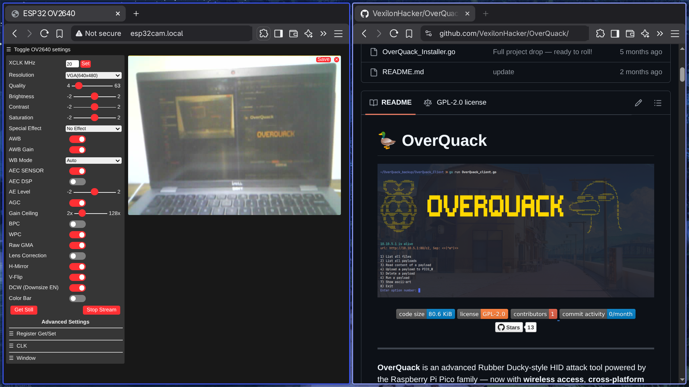

# ESP32-Wrover CAM JPEG Streaming
 
This project allows you to use an **ESP32-Wrover CAM module** to stream live video over Wi-Fi in JPEG format. It supports single-frame capture, MJPEG streaming, and basic camera control via HTTP.

---

## Features

- JPEG image streaming via web browser (`/stream`)
- Single capture in JPEG (`/capture`) or BMP (`/bmp`)
- Camera control via HTTP (`/control`)  
  Parameters include brightness, contrast, saturation, framesize, vflip, hmirror, etc.
- Wi-Fi connection with MDNS support (`http://esp32cam.local`)
- High-resolution streaming if PSRAM is available
- Lightweight, simple, and easy to use

---

## Folder Structure

```bash
.
├── include
│   ├── camera_index.h   # Compressed HTML UI assets
│   ├── config.h         # Wi-Fi and camera pin definitions
│   └── setup.h          # Function declarations for setup
├── lib
│   └── README
├── platformio.ini       # PlatformIO build configuration
└── src
    ├── app_httpd.cpp    # Web server & streaming logic
    ├── main.cpp         # Entry point (setup & loop)
    └── setup.cpp        # Camera and Wi-Fi initialization
```

---

## Configuration

Edit `include/config.h` to configure Wi-Fi :

```c
#define WIFI_SSID "YOUR_WIFI_AP_NAME"
#define WIFI_PASS "YOUR_WIFI_PASSWD"

#define MDNS_NAME "esp32cam" // Access via http://esp32cam.local

// ESP32 WROVER CAM pin mapping
#define PWDN_GPIO_NUM  -1
#define RESET_GPIO_NUM -1
#define XCLK_GPIO_NUM  21
#define SIOD_GPIO_NUM  26
#define SIOC_GPIO_NUM  27
#define Y9_GPIO_NUM    35
#define Y8_GPIO_NUM    34
#define Y7_GPIO_NUM    39
#define Y6_GPIO_NUM    36
#define Y5_GPIO_NUM    19
#define Y4_GPIO_NUM    18
#define Y3_GPIO_NUM    5
#define Y2_GPIO_NUM    4
#define VSYNC_GPIO_NUM 25
#define HREF_GPIO_NUM  23
#define PCLK_GPIO_NUM  22
```

---

## Installation

### 1. Install PlatformIO CLI

If you don’t have PlatformIO installed, follow the instructions here: __[platformio.org](https://platformio.org/install/cli)__


---

### 2. Clone the Repository

Download the project using `git`:

```bash
git clone https://github.com/VexilonHacker/ESP32-Wrover-CameraWebServer
cd ESP32-Wrover-CameraWebServer 
```

---

### 3. Configure Wi-Fi 

Edit the configuration file to set your Wi-Fi credentials in __`include/config.g`__:
```c 
#define WIFI_SSID "YOUR_WIFI_AP_NAME" // your Wi-Fi network name
#define WIFI_PASS "YOUR_WIFI_PASSWD" // your Wi-Fi password 
```

---

### 4. Build and Upload Firmware using PlatformIO CLI

Connect your ESP32-Wrover CAM to the PC via USB. Then run:

```bash
pio run --target upload
```

This will compile the firmware and upload it to the board.  

---

### 5. Monitor Serial Output

To check the ESP32 boot messages, IP address, and debug logs:

```bash
pio device monitor --baud 115200
```

You should see something like:

```
WiFi connected ;]
IP address: 192.168.1.100
or check "http://esp32cam.local"
```

---

## Usage

1. Open a browser and navigate to `http://<IP_ADDRESS>` or `http://esp32cam.local`.
2. Available URLs:
   - `/` → Camera control UI
   - `/capture` → Single JPEG snapshot
   - `/bmp` → Single BMP snapshot
   - `/stream` → MJPEG live stream
   - `/status` → Camera settings in JSON
   - `/control?var=brightness&val=2` → Change camera parameters
   - `/resolution` → Set window resolution

---

## Camera Parameters

You can adjust camera settings via HTTP GET `/control`. Available parameters:

| Parameter       | Description                               |
|-----------------|-------------------------------------------|
| framesize       | Image resolution (FRAMESIZE_*)           |
| quality         | JPEG quality                              |
| brightness      | -2 to +2                                  |
| contrast        | -2 to +2                                  |
| saturation      | -2 to +2                                  |
| vflip           | Vertical flip (0/1)                       |
| hmirror         | Horizontal mirror (0/1)                   |
| awb             | Auto white balance (0/1)                  |
| agc             | Auto gain control (0/1)                   |
| aec             | Auto exposure (0/1)                       |
| led_intensity   | LED flash intensity (if LED defined)      |

---

### Camera Control Examples Using `curl`

```bash
# Set brightness to maximum
curl 'http://esp32cam.local/control?var=brightness&val=2'

# Reset brightness
curl 'http://esp32cam.local/control?var=brightness&val=0'

# Enable vertical flip
curl 'http://esp32cam.local/control?var=vflip&val=1'

# Disable vertical flip
curl 'http://esp32cam.local/control?var=vflip&val=0'

# Enable horizontal mirror
curl 'http://esp32cam.local/control?var=hmirror&val=1'

# Disable horizontal mirror
curl 'http://esp32cam.local/control?var=hmirror&val=0'

# Check camera status in JSON
curl 'http://esp32cam.local/status' | jq
```


---

## Notes

- High-quality streaming requires PSRAM on the ESP32-Wrover CAM.
- MJPEG streaming is handled in real-time by the onboard HTTP server.

---

## License

This project is licensed under the **Apache License 2.0**. 

